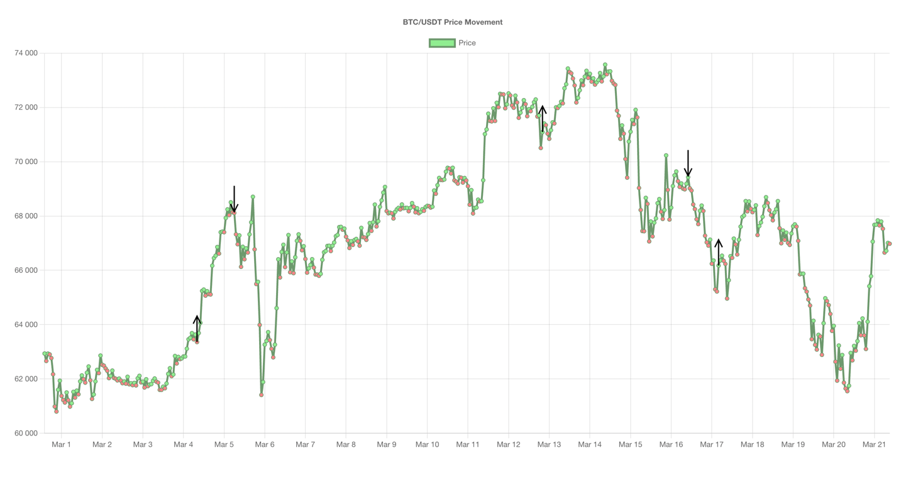

# Candlestick Chart App

## Overview
The Candlestick Chart App is a web application built using React and Chart.js. It allows users to visualize historical price movements of the BTC/USDT trading pair and generates buy/sell signals based on a simple moving average (SMA) crossover strategy.

## Features
- Fetches candlestick data from the Binance API.
- Calculates short-term and long-term SMAs.
- Generates buy and sell signals based on SMA crossovers.
- Displays candlestick chart with buy/sell annotations using Chart.js.

## Files
- `CandlestickChart.tsx`: React component responsible for fetching data, generating signals, and rendering the candlestick chart.
- `handler.ts`: Contains functions to generate signals and calculate SMAs.

## Installation
1. Clone the repository:
   ```
   git clone https://github.com/dianaasamkova/candlestick-chart-app.git
2. Navigate to the project directory:
   ```
   cd candlestick-chart-app 
3. Install dependencies:
### `yarn install`
4. Start the development server:
### `yarn start`
5. To run tests:
### `yarn test`

## Screenshots 
### Application overview



